# Simple Chat


## 🚀我所做的前置准备
PS: 如果您只是想看API如何调用，可以直接跳过该节 👏

注册[openrouter](https://openrouter.ai/)，并使用里面提供的免费model
“Mistral 7B Instruct”作为ai provider，以此为基础开发聊天对话机器人。

MongoDB: 这里的数据库我用的是[MongoDB Atlas](https://www.mongodb.com/atlas/database)

部署服务使用[Deta Space](https://deta.space/)

## ⚓需求中提到的API
### get_ai_chat_response
>用户输入问题，通过ai provider 返回ai 的回答

- 输入参数
  - message: str 用户输入的聊天内容
  - username: str 聊天的人名字
- 输出参数
  - response: str AI 的本次问题回答
> 注意点：
  如果超过了model 的token 最大限制，需要自动middle out 中间的内
容，比如"openchat 3.5"的最大token 是8,192，如果输入了
12000token，需要自动把中间的4000-5000token 的文字删掉，然后再
传给openrouter

### get_user_chat_history
> 根据输入参数输出用户的聊天记录

- 输入参数
  - username: str 聊天的人名字
  - last_n: int 输出最后n 条聊天记录
- 输出i 个历史记录的array
> 例子：[{"type": "user", "text": "hi, my name is Eric"}, {"type": "ai", "text":
"Hi Eric, what can I do for you!"}]

> 注意点：
聊天记录应该是middle out 之前的内容而不是middle out 后传入
openrouter 的内容。用户只能获取自己的聊天记录

### get_chat_status_today
> 返回用户当天聊天次数，对应后面做聊天控制的要求

- 输入
  - username: str 聊天的人名字
- 输出 当天已经聊天次数
> 例子：{"username": "xxx", "chat_cnt": 3}

### 对用户的聊天进行控制
- 一个用户一天最多发送20 条信息，超过返回401 和对应error
- 一个用户每30 秒最多发送3 条信息，超过返回401 和对应error

例子：
```
response = get_ai_chat_response(
message = "hi, my name is Eric",
username = "eric",
)
```
>输出：Hi Eric, what can I do for you!
print(response)

```
response = get_user_chat_history(
user_name = "eric"
last_n = 2
)
```
>输出: [{"type": "user", "text": "hi, my name is Eric"}, {"type": "ai", "text": "Hi Eric, what
can I do for you!"}]

```print(response)```

## ✈️该程序中所做的扩展
因为FastAPI 是一个现代 Web 框架，用于在 Python 中构建 RESTful API。所以在实现上述需求的过程中，根据构建REST APIs的最佳实践，我对程序做了一些小修改。
参考文献：
- [Building REST APIs with Python and FastAPI](https://medium.com/@ramjoshi.blogs/building-rest-apis-with-python-and-fastapi-f0e9ae19905c)
- [REST API URI Naming Conventions and Best Practices](https://restfulapi.net/resource-naming/)

我对以上需求中的三个API做了URI命名上的映射：

| API实际调用的函数名 | API URI |
| :----: | :----: |
| get_ai_chat_response | /llm/message |
| get_user_chat_history | /user/history/{last_n} |
| get_chat_status_today | /user/status |

## 🚞根据用户管理需求做的调整
API在进行调用前，需要先获取Bearer Token。而 Bearer Token则在用户执行登录操作或者调用 ```/token```获取。

1. **对于第一次使用API的用户**，其首先需要通过调用```/user/```创建一个*User*

成功创建的信息如下：
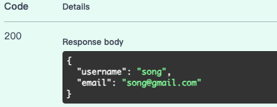
需要注意的是，在该程序中username具有唯一性，也就是说如果有人先用了您喜欢的username，那您就只能 try another 了;)


2. 现在我们有了一个账号，如果我们不想调用```/token```,也可以用图形化一点的方法，如下图这般操作即可：
   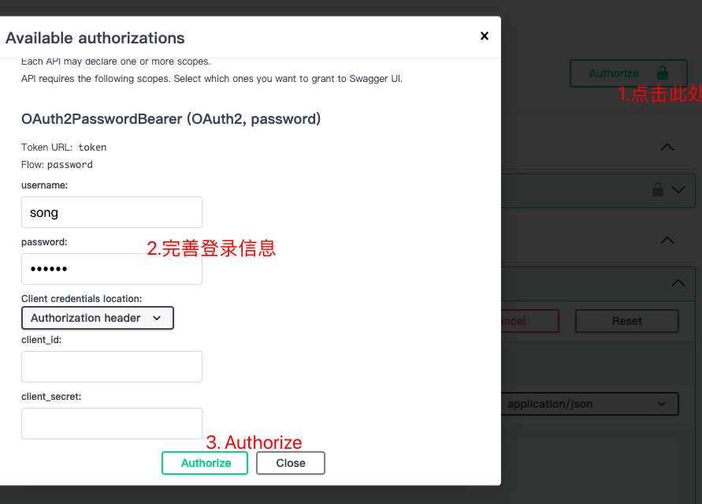
成功的反馈如下：
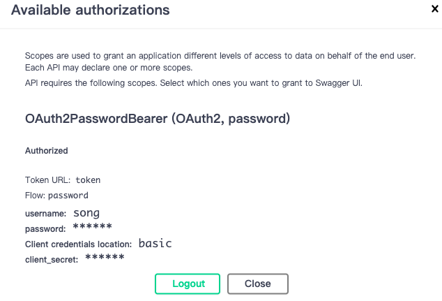

3.然后我们就可以使用```/llm/message```URI与LLM通信了
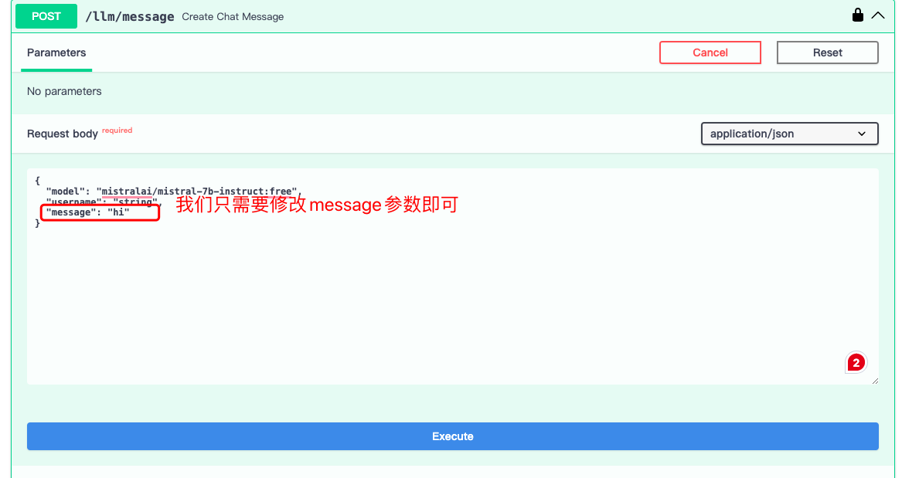
成功反馈如下：
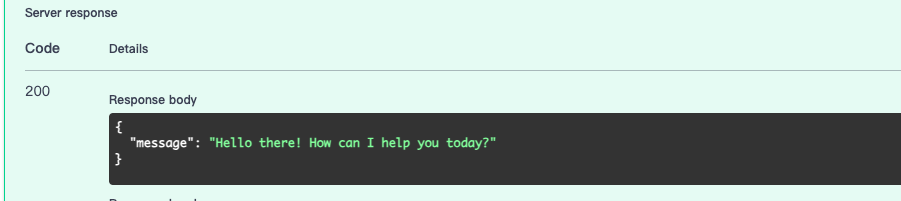

## 查询用户历史聊天记录
这个环节我们使用```/user/history/{last_n}```进行查询
界面如下：
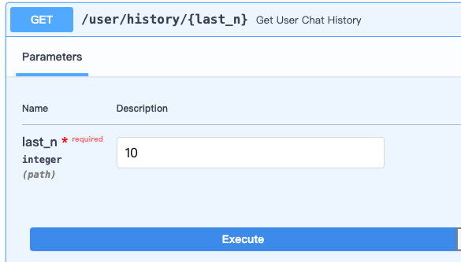
成功反馈如下：
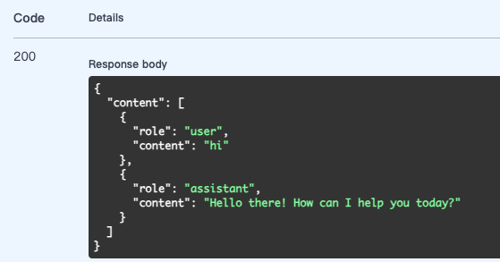

## 🔍查询用户当天聊天次数
这个功能我们使用```/user/status```
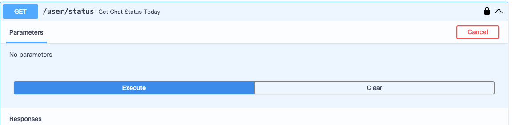
成功反馈如下：
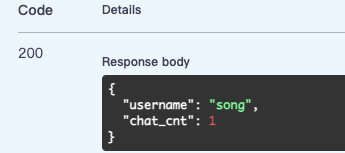

## ⏰扩展选做题
| API实际调用的函数名 | API URI |
| :----: | :----: |
| get_ai_chat_response_advanced | /llm/message/advanced |
| get_user_behavior | /user/report |

### get_ai_chat_response_advanced
该API可通过/llm/message/advanced进行调用
该API是get_ai_chat_response的进阶版，在用户调用该API的时候，AI的回复被设计为让其更具有人文关怀。参考文献：

- [I Made a Chatbot Cry Happy](https://medium.com/@anthonyodugan/i-made-a-chatbot-cry-happy-a905aa6aad1e)
- [Unlocking User Psychology in Large Language Models: Receptiviti Augmented Generation](https://medium.com/@receptiviti/unlocking-user-psychology-in-large-language-models-receptiviti-augmented-generation-dfcaecce6812)
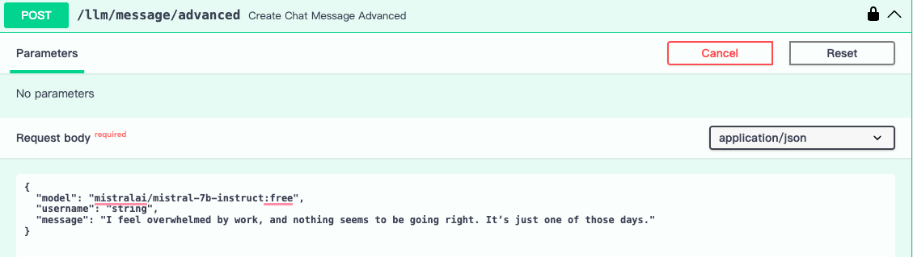
成功反馈如下：
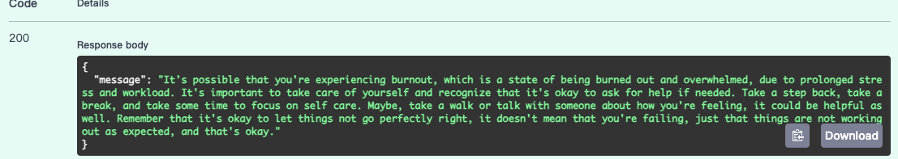
### get_user_behavior
- 基于用户与AI 的聊天历史，分析用户的兴趣点和行为模式。
- 通过get_user_behavior API 提供用户行为分析的摘要报告。
- 分析报告应包括用户最常讨论的主题、活跃时间段等信息。
该API可通过/user/report进行调用
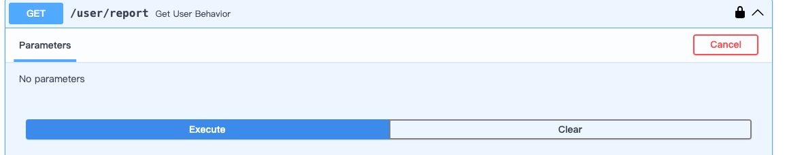
成功反馈如下：
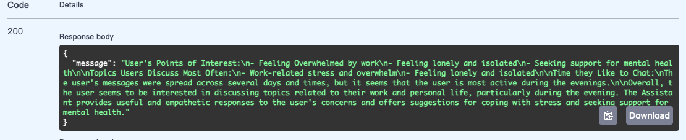
该报告的信息将会以Markdown语法输出